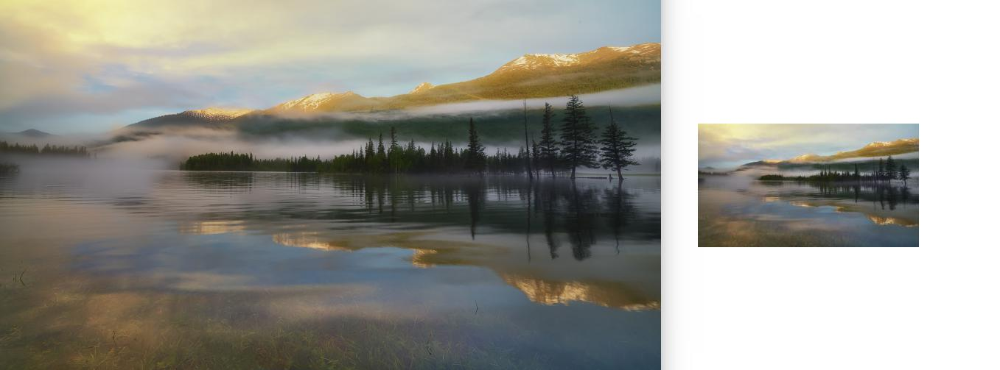
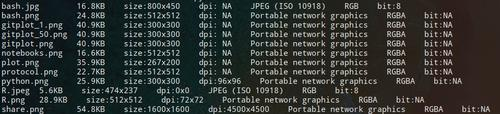

# Karobben-Work-Station

<a href="#Dontouch">DontouchWhite.py</a> A script for playing a web game  
<a href="#GPS">GPS_get.py</a> There are two scripts working in different regions<br>
<a href="#Imresize">Imresize.py</a> A light image/imges resize python script for resizing one or a group of img.<br>
<a href="#Kivy">Kivy_animation_1.py</a> A example of animation in Kivy.<br>
<a href="#Squirtle">Squirtle.py</a> A simple pixel animation in terminal.<br>


## <div id="Dontouch">DontouchWhite.py</div>

This script is using PIL to read the img from the screen and using OpenCV to read and find the target bin, and using pynput to click the target.

for more, please go to see:

https://www.bilibili.com/video/av86328254

## <div id="GPS">GPS_get.py</div>

GPS-get_geojs.py is using crawling based on requests. It works fine if you can easily achieve https://get.geojs.io. So, it is not friendly for some regions.<br>
The time consuming process is acquiring your IP address. So, you can speed it up by providing IP address yourself.

GPS-get_geocoder.py is using geocoder lib and it is super elegant. You can print your region and GPS coordinate with only three lines of code.

And for my personal experience, the result of geocoder is a little better than the result of geojs.

Both scripts should work:


```bash
python3 GPS-get_geojs.py
python3 GPS-get_geocoder.py
```

And you can pin the GPS coordinate on maps in http://www.gpsspg.com/maps.htm


## <div id="Imresize">Imresize.py</div>


### Single Img
```bash
Imresize.py -i input.png  #w=w/2, h=h/2
Imresize.py -i input.png -w #900 #w=900
Imresize.py -i input.png -t #900 #h=900
Imresize.py -i input.png -r 4 #w=w/4, h=h/4
```
You can resize img/imgs by width(-w), by height(-t), by both(-w -t) or by ratio(-r).<br>
You can also read one img each time, with default arguments, output file names as "Re_" + input.png.<br>

### Multiple Images
You can resize a group of img by using: -i *.png (the quotation marks here can not be omitted). The result will be importted to a directory with the same name.<br>
You can also read all imgs form a directory(single directory each). The way output is the same as when you read a bunch of img in a time.

An example:  

```bash
Imresize.py -i 1.png 2.png -w 300
Imresize.py -i *.png  -w 300
Imresize.py -i img/ -w 300
```

### Customizing Output formate

`Imresize.py -i *.png -w 300 -o Re_size -f jpg`
<p align='center' >

</p>


## Update:

2020/2/9: Add print information function

```bash
Imresize.py -i "*" -inf 1
```
<p align='center' >

</p>


2020/2/16  
1. Reading files as a list
2. Printing inf without extra arguments.  
3. Formatting all Output files

Printing img(s) inf

`Imresize.py -i * -inf`

Formatting Output images

Output all imgs as jpg formate
`Imresize2.py -i *.png -f  jpg`


## <div id="Kivy">Kivy_animation_1.py</div>

This script is origin from tshirtman, https://gist.github.com/tshirtman/5466755.<br>
I customized it to python3.<br>
If there has any offensive, please contack me and I will deleted it.

```
python3.7 Kivy_animation_1.py
```

<p align='center' >

</p>

## <div id="Squirtle">Squirtle.py</div>

This is a simple pixel Squirtle animation in terminal.

```bash
python3.7 Squirtle.py
```
<p align='center' >

</p>
